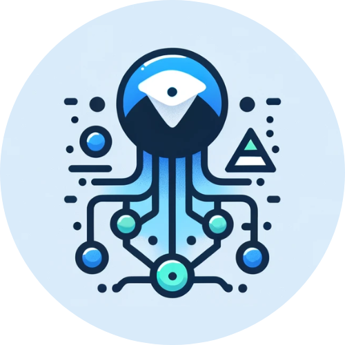

<p align="center">
  
  <a href="https://github.com/hschickdevs/Telegram-AI-Software-Architect/stargazers"></a>
  <a href="https://github.com/hschickdevs/Telegram-AI-Software-Architect/blob/main/LICENSE"></a>
</p>

<!-- PROJECT LOGO -->
<br />
<div align="center">
  

  <h3 align="center">Telegram-AI-Software-Architect</h3>

  <p align="center">
    A powerful Telegram bot that uses large language models (LLMs) to architect fully structured, ready-to-deploy software from user prompts in a matter of seconds.
    <br />
    <h4>Notable Features:</h4>
    <p>
        <i>Single model call for software generation to reduce token cost</i>
    </p>
    <p>
        <i>Supports <a href="https://platform.openai.com/docs/models/gpt-4-and-gpt-4-turbo">OpenAI</a> and <a href="https://www.anthropic.com/claude">Claude</a> language models</i>
    </p>
    <p>
        <i>Output zip includes requirement and readme files for setup & usage</i>
    </p>
    <a href="#about-the-project"><strong>Learn More »</strong></a>
    <br />
    <br />
    <a href="https://t.me/SoftwareArchitect_bot">Try Demo</a>
    ·
    <a href="#deployment">Deployment</a>
    ·
    <a href="#bot-commands">Commands</a>
    ·
    <a href="#contributing">Contribute</a>
  </p>
</div>

<!-- # Telegram-AI-Software-Architect

> 🚧 _CURRENTLY IN DEVELOPMENT ..._

 Telegram bot that uses AI to generate full software codebases from user prompts. It provides structured, ready-to-deploy software, differentiating from simple code generation by offering entire architectural solutions. Prompt the bot with a detailed description of the software you want to build, and it will generate a full codebase for your software and send the zipped code the Telegram chat.

 **Notable Features**:

 * Codebase generation is done in a single API call to save on context token cost.

 * Supports [OpenAI](https://platform.openai.com/docs/models/gpt-4-and-gpt-4-turbo) and [Claude](https://www.anthropic.com/claude) language models (_Claude performs significantly better_)

 > **Note:** Even though the Claude and OpenAI models are supported, Claude actually performs much better in this specific task. 

 ## Testing Prompts:

 `/generate basic software that allows the user to input two numbers from the command line. The output to the console should be "HELLO WORLD! Here is your number: <number>"` -->

<!-- ABOUT THE PROJECT -->
## About the Project


This Telegram bot leverages the power of OpenAI or Claude's large language models to provide full architectured software solutions, zipped and ready to go in your convenient Telegram chat window. The output includes requirement and readme files for easy setup and usage. The bot is capable of generating codebases for a wide range of software projects, from simple command-line applications to complex web applications. 

Here is an example of a codebase that was architected for another `todo-app` software, given a [more detailed context](./tests/message3.txt):

```
todo-app/
├── README.md
├── requirements.txt
└── src/
    ├── app.py
    ├── database.py
    ├── schema.sql
    ├── todo.py
    ├── static/
    │   ├── css/
    │   │   └── styles.css
    │   └── js/
    │       └── app.js
    └── templates/
        ├── base.html
        └── index.html
```

Just simply prompt the bot with a detailed description of the software you want to build, and it will generate and send the zipped software codebase the Telegram chat.

> 💡 **Tip:** The [Claude 3 Opus](https://www.anthropic.com/news/claude-3-family) model has proven to be exceptionally more effective at generating the codebases than even the best OpenAI GPT models.


<!-- DEPLOYMENT -->
## Deployment

To get your own local instance of the Telegram AI Codebase Architect bot up and running, follow these simple steps:

### Prerequisites

1. Before you continue, you will need to secure either an OpenAI API key or an Anthropic Claude API key.

    **Option a.** Get an OpenAI API key using [**this guide**](https://www.maisieai.com/help/how-to-get-an-openai-api-key-for-chatgpt) for reference.

    **Option b.** Get a Claude API key using [**this link**](https://console.anthropic.com/) for reference.

    > 💸 Before sure to review pricing for the APIs in deciding which model to use.

2. Choose your preferred model to use for the bot.

    If you are using OpenAI, it is recommended to use the latest gpt4 model. If you are using Claude, it is recommended to use the Claude 3 Opus model. The process of generating entire codebases is very complex and requires advanced LLMs. In this case, paying for the best model is worth it.

    You will need to find the model code for these. For example, the latest version of the Claude 3 Opus model's code is `claude-3-opus-20240229`.

2. Create a new **Telegram bot** and get the **bot token** using [**BotFather**](https://t.me/botfather). If you don't know how to do so, you can use [**this guide**](https://www.siteguarding.com/en/how-to-get-telegram-bot-api-token) for reference.

Make sure that you have saved your model APIKEY, model code, and bot token in a safe place. You will need them in the next steps. 

### Installation & Setup

Before continuing, ensure that you have docker installed on your system. If you do not, you can download it [**🔗 here**](https://www.docker.com/products/docker-desktop).

_Docker container development in progress ..._


<!-- 1. Pull the Docker image from Docker Hub:

   ```sh
   docker pull hschickdevs/telegram-translate-ai
   ```

2. Run the Docker image:

    You will need to specify your OpenAI API key and Telegram bot token as environment variables. Additionally, you can specify the GPT model to use (e.g., `gpt-3.5-turbo` or `gpt-4`, or any desired model [listed on their website](https://platform.openai.com/docs/models/continuous-model-upgrades)). You can leave the `MODEL` environment variable empty to use the default model (3.5 turbo).

    ```sh
    docker run -d --name telegram-translate-ai \
      -e OPENAI_TOKEN=<YOUR_APIKEY> \
      -e BOT_TOKEN=<YOUR_TELEGRAM_BOT_TOKEN> \
      -e MODEL=<GPT-MODEL> \
      hschickdevs/telegram-translate-ai
    ```

  3. If you want to see the logs, you can use the following command:

      ```sh
      docker logs -f telegram-translate-ai
      ```

      You can also attach to the container to see the logs in real-time:

      ```sh
      docker attach telegram-translate-ai
      ```

      If you don't see any errors, the bot should now be running! Head to your bot on Telegram and test it out. -->

<!-- USAGE EXAMPLES -->
## Bot Commands

#### `/help`

Returns all available commands and their descriptions.

___

#### `/generate <context>`

🛠️ Generate a software codebase given the context.

> For the highest quality output, it is recommended to use the Claude 3 Opus model, as well as provide a detailed context for the software you want to be architected.

_For (a very simple) example:_ 

`/generate a simple web application that allows users to create, read, update, and delete tasks. The application should be built using the Flask framework and should use a SQLite database to store the tasks.` 

___

#### `/ask <context>`

💬 Ask the model anything and receive a standard response.

_For example, the following command asks the bot how Docker works:_

`/ask How does Docker work?`

___

#### `/contact`

📞 Contact the developer for support or feedback.

<!-- CONTRIBUTING -->
## Contributing

[![Contributors][contributors-shield]][contributors-url]
[![Issues][issues-shield]][issues-url]

Contributions are what make the open source community such an amazing place to learn, inspire, and create. Any contributions you make are **greatly appreciated**.

If you don't have any ideas, see the [open issues](https://github.com/hschickdevs/Telegram-AI-Codebase-Architect/issues) for a list of proposed features (and known issues) to address.

1. Fork the Project
2. Create your Feature Branch (`git checkout -b feature/AmazingFeature`)
3. Commit your Changes (`git commit -m 'Add some AmazingFeature'`)
4. Push to the Branch (`git push origin feature/AmazingFeature`)
5. Open a Pull Request


<!-- LICENSE -->
## License

Distributed under [GPLv3.0](./LICENSE), a free software license that allows you to use, modify, and distribute the software for personal and commercial use. 

However, any changes you make must also be open-sourced under the same license. This ensures that derivative work remains free and open, promoting collaboration and transparency. Importantly, if you distribute the software or any modifications, you must make the source code available and clearly state any changes you've made.


<!-- CONTACT -->
## Contact

**Telegram:** [@hschickdevs](https://t.me/hschickdevs)

<!-- MARKDOWN LINKS & IMAGES -->
<!-- https://www.markdownguide.org/basic-syntax/#reference-style-links -->
[contributors-shield]: https://img.shields.io/github/contributors/hschickdevs/Telegram-AI-Codebase-Architect.svg?style=for-the-badge&color=blue
[contributors-url]: https://github.com/hschickdevs/Telegram-AI-Codebase-Architect/blob/main/bot/__init__.py

[issues-shield]: https://img.shields.io/github/issues/hschickdevs/Telegram-AI-Codebase-Architect?style=for-the-badge&color=red
[issues-url]: https://github.com/hschickdevs/Telegram-AI-Codebase-Architect/issues
